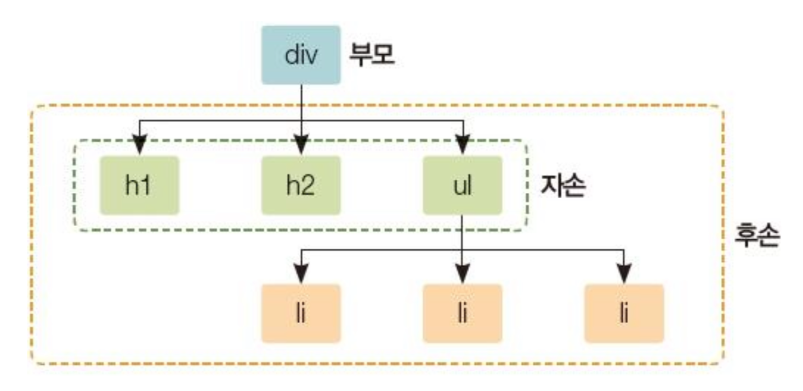

## CSS3 스타일시트

- 스타일시트 : CSS로 작성된 코드
  - e.g. `h1 {background-color : red;}`
    - h1 : 선택자
    - background-color : 스타일 속성
    - red : 스타일 값

## CSS 선택자

- 기본 선택자

	| 선택자 종류   | 형태    | 설명                                                              |
  | ------------- | ------- | ----------------------------------------------------------------- |
  | 전체 선택자   | \*      | HTML 페이지 내부의 태그 모두 선택                                 |
  | 태그 선택자   | 태그    | HTML 페이지 내부의 특정 태그 모두 선택                            |
  | 아이디 선택자 | # 아이디 | 특정 Id 속성이 있는 태그 선택, 중복 가능 - in js : 중복 문제 발생 |
  | 클래스 선택자 | .클래스 | 특정 클래스가 있는 태그 선택                                      |
- 속성 선택자
	
  | 속성 선택자 형태 | 설명                                             |
  | ---------------- | ------------------------------------------------ |
  | 선택자[속성]     | 특정 속성이 있는 태그 선택                       |
  | 선택자[속성=값]  | 특정 속성 내부 값이 특정 값과 일치하는 태그 선택 |
- 후손 선택자 : 지정한 태그 아래에 위치한 모든 태그
	
  | 후손 선택자 형태 | 설명                          |
  | ---------------- | ----------------------------- |
  | 선택자A 선택자B  | 선택자A의 후손인 선택자B 선택 |
  
  
- 자손 선택자 : 지정한 태그 기준 바로 한 단계 아래에 위치한 태그
	
  | 자손 선택자 형태  | 설명                          |
  | ----------------- | ----------------------------- |
  | 선택자A > 선택자B | 선택자A의 자손인 선택자B 선택 |
- 반응 선택자 : 사용자 반응으로 생성되는 특정 상태 선택
	
  | 반응 선택자 형태 | 설명                                  |
  | ---------------- | ------------------------------------- |
  | 선택자:active    | 사용자가 마우스로 클릭한 태그 선택    |
  | 선택자:hover     | 사용자가 마우스 커서를 올린 태그 선택 |
- 상태 선택자 : 입력 양식의 상태 선택
	
  | 상태 선택자 형태 | 설명                                                                                                    |
  | ---------------- | ------------------------------------------------------------------------------------------------------- |
  | 선택자:checked   | type 속성이 checkbox/radio인 태그가 선택된 상태                                                         |
  | 선택자:focus     | 사용자가 바로 입력할 수 있도록 입력 양식에 포커스를 둔 상태(웹 페이지 당 input 태그 하나에만 사용 가능) |
  | 선택자:enabled   | input 태그에 값을 입력할 수 있는 상태                                                                   |
  | 선택자:disabled  | input 태그에 값을 입력할 수 없는 상태                                                                   |
- 구조 선택자 : 특정 위치에 있는 태그 선택
	
  | 구조 선택자 형태              | 설명                                          |
  | ----------------------------- | --------------------------------------------- |
  | 선택자:first-child            | 형제 관계에서 첫 번째로 등장하는 태그         |
  | 선택자:last-child             | 형제 관계에서 마지막으로 등장하는 태그        |
  | 선택자:nth-child(수열)        | 형제 관계에서 앞에서 수열번째로 등장하는 태그 |
  | 선택자:nth-last-child(수열)   | 형제 관계에서 뒤에서 수열번째로 등장하는 태그 |
  | 선택자:first-of-type          |                                               |
  | 선택자:last-of-type           |                                               |
  | 선택자:nth-of-type(수열)      |                                               |
  | 선택자:nth-last-of-type(수열) |                                               |
