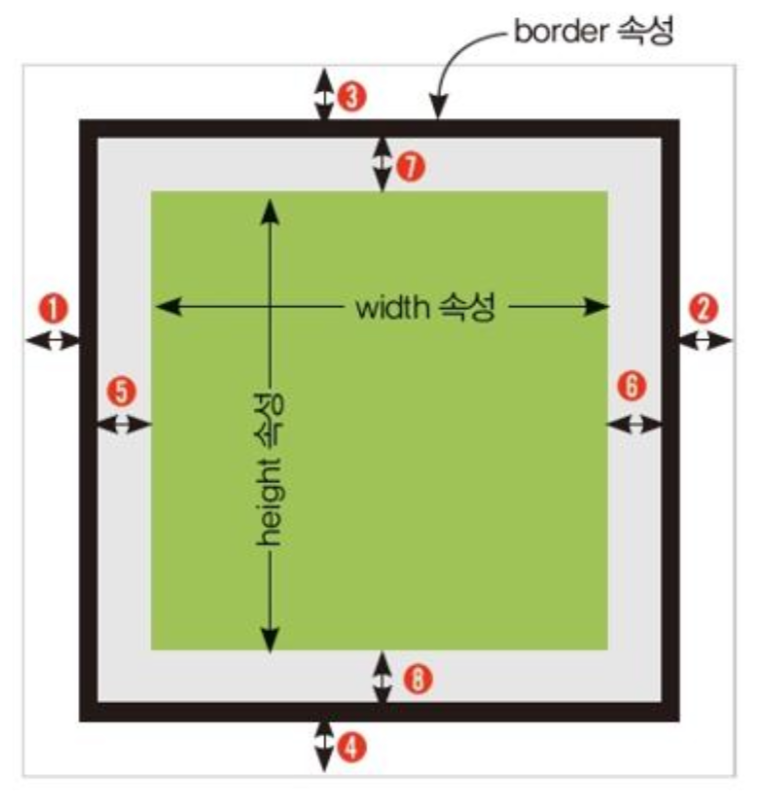

# CSS3 속성

## 박스 속성

- 박스 속성 : 웹 페이지 레이아웃 구성 시 중요
  
 
  | 박스 속성 | 설명 |
  | --------- | ------------------------------------------------------------------------- |
  | margin | 테두리 바깥쪽 여백(다른 요소와의 간격) ⇒ margin : 위쪽 오른쪽 아래쪽 왼쪽 |
  | border | 테두리 |
  | padding | 테두리 글자 사이의 테두리 안쪽 여백 ⇒ padding : 위쪽 오른쪽 아래쪽 왼쪽 |
  | width | 글자를 감싸는 영역의 가로 크기 |
  | height | 글자를 감싸는 영역의 세로 크기 |

 
  | 위치 | 속성           | 설명        |
  | ---- | -------------- | ----------- |
  | ①    | margin-left    | 왼쪽 여백   |
  | ②    | margin-right   | 오른쪽 여백 |
  | ③    | margin-top     | 위쪽 여백   |
  | ④    | margin-bottom  | 아래쪽 여백 |
  | ⑤    | padding-left   | 왼쪽 패딩   |
  | ⑥    | padding-right  | 오른쪽 패딩 |
  | ⑦    | padding-top    | 위쪽 패딩   |
  | ⑧    | padding-bottom | 아래쪽 패딩 |

- margin, padding 사용 구분
  - 4개의 방향값 모두 표시할 경우
    
	  | margin | padding |
    | ----------------------- | ----------------------- |
    | 위쪽 오른쪽 아래쪽 왼쪽 | 위쪽 오른쪽 아래쪽 왼쪽 |
  - 2개의 방향값만 표시할 경우
    
	  | margin | padding |
    | ----------------------- | ----------------------- |
    | <위 아래> <왼쪽 오른쪽> | <위 아래> <왼쪽 오른쪽> |
- 박스 테두리

	| 박스 속성 | 설명 |
	| ------------ | ---------------- |
  | border-width | 박스 테두리 굵기 |
  | border-style | 박스 테두리 형태 |
  | border-color | 박스 테두리 색상 |

## 가시 속성

- 가시 속성 : 태그가 화면에 보이는 방식 지정 ⇒ 대표적 : `display`

  | 가시 속성 키워드 | 설명 |
  | ---------------- | ----------------------------------------------------------------------------- |
  | none | 화면에 보이지 않음 |
  | block | 블록 박스 형식으로 지정 |
  | inline | 인라인 박스 형식으로 지정 - width, height, margin, padding 속성 지정 X |
  | inline-block | 블록과 인라인의 중간 형태로 지정 - width, height, margin, padding 속성 지정 O |

## 배경 속성

- 배경 속성 ⇒ `background`
 
  | 배경 속성 | 설명 | e.g. |
  | --------------------- | -------------------------------------------------------- | ----------------------------- |
  | background-image | 배경 이미지 삽입 | background-image: url(); |
  | background-size | 배경 이미지의 크기 지정 | background-size: 100%; |
  | background-repeat | 배경 이미지의 반복 형태 지정 | background-repeat: no-repeat; |
  | background-attachment | 배경 이미지의 부착 형태 지정 ⇒ 배경 이미지를 화면에 고정 | background-attachment: fixed; |
  | background-position | 배경 이미지의 위치 지정 | background-position: bottom; |
  | background | 한 번에 모든 배경 속성 입력 | |
