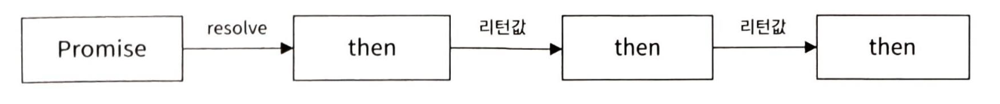
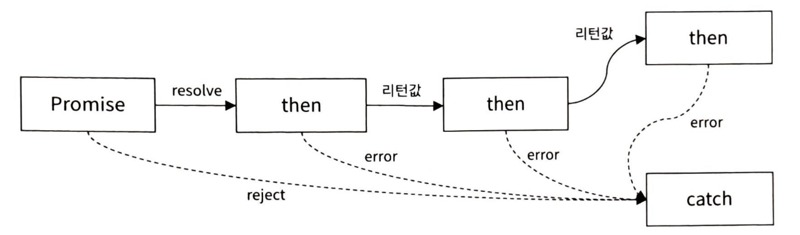

## Vue.js

## MVVM 패턴

- `Model` - `View` - `ViewModel`
- app 로직과 UI 분리를 위해 설계된 패턴
  - View : HTML, CSS로 작성
  - ViewModel : View의 실제 논리 및 데이터 흐름 담당

## 가상 DOM

- 브라우저 메모리에서 관리하는 `DOM`에 대한 추상 객체
- 빠른 UI 랜더링 성능 제공
- 브라우저 DOM : 화면에 직접적으로 그리는 작업 수행
- 가상 DOM : 변경된 부분 탐지 목적

## ES6

- ECMAScript6
- 미지원 브라우저에 대한 대처 : `Transpiler`를 통해 `ES6` → `ES5` 코드 변환, `vue.js`에서 자동 처리

## let & const & var

- 호이스팅 : 변수/힘수 선언이 코드의 상단으로 끌어올려지는 것처럼 동작하는 특징
- `var` : 함수 단위 호이스팅, 최근 사용 X, 변수 선언 중복 가능
- `let` : ES6에서 도입한 블록 단위 변수 선언, 호이스팅 지원 X
- `const` : 값 변경 불가 ⇒ 상수 선언, 범위는 `let`과 동일, 참조는 변경 X (필드는 수정 O)

## Parameter

- 기본 파라미터 : 함수 호출 시, 인수를 생략했을 때 가지는 기본값 ⇒ 반드시 뒷부분에 지정

  ```jsx
  function addContact(name, mobile, home = '없음', address = '없음') {
    let str = `name = ${name}, mobile = ${mobile}, home = ${home}, address${address}`;
    console.log(str);
  }
  ```

- 가변 파라미터 : 전달하는 파라미터의 개수를 가변적으로 적용 ⇒ 매개변수 앞 `...`연산자 지정, 1개만 지정 가능(마지막 매개변수)
  ```jsx
  function func(arg1, arg2, ...argv) {}
  ```

## 구조분해 할당

- 배열, 객체의 값들을 추출하여 한 번에 여러 변수를 할당할 수 있는 기능
  ```jsx
  let [a1, a2, a3, ...] = arr;
  ```

## ES6 모듈

- 모듈 : js 코드를 포함하고 있는 파일
- `import`, `export`를 통해 모듈을 가져오거나 내보낼 수 있음
- 모듈 내 선언된 모든 변수, 함수, 객체, 클래스 ⇒ `local`로 간주
- 재사용 가능한 모듈 ⇒ 외부에 공개하는 것을 `export` 해야 함
- `export`된 모듈 ⇒ 다른 모듈에서 `import` 가능

## Promise

- 비동기 처리 지원
- 콜백 함수 : 중첩 문제 발생
- 정상 처리 시
  
- 오류 발생 시
  

## 전개연산자

- 배열/객체를 `...`연산자와 함께 사용 ⇒ 객체/배열에서 사용
- 기존 값 복사/새로운 항목 추가 시 사용

## Proxy

- 객체의 속성을 읽어오거나 설정하는 작업을 가로채기 위해 래핑할 수 있도록 하는 객체
- 객체의 속성에 접근 시, 개발자가 원하는 작업 수행 가능
- Vue 내부에서 Proxy 사용 ⇒ 개발자가 직접 개발 X, 반응성 지원을 위함
