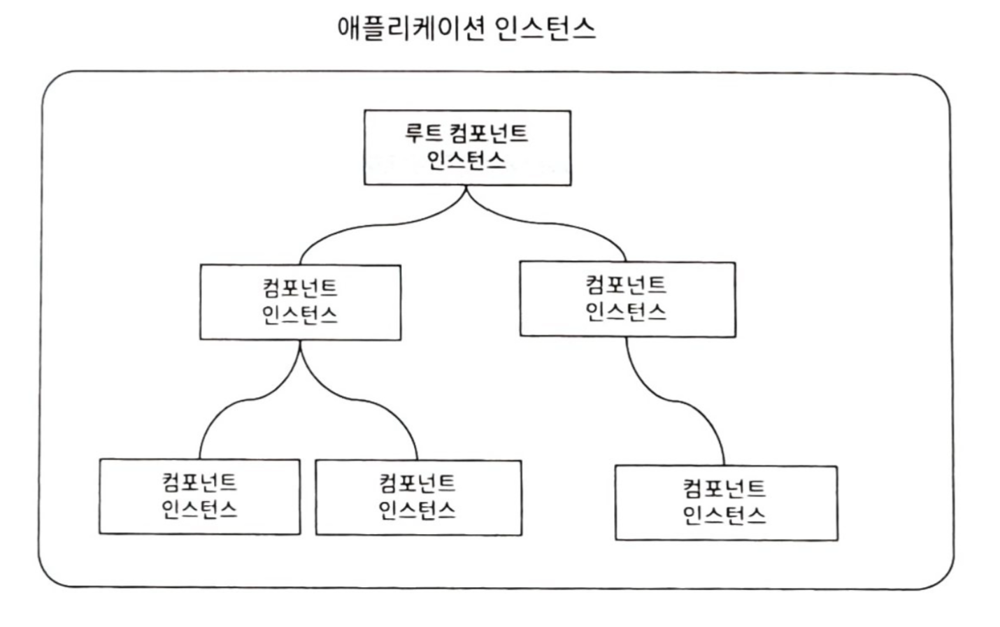

## 단일 파일 컴포넌트

- 컴포넌트 하나를 `.vue` 파일 하나에 작성
- 파일 하나 : 템플릿, 스크립트, 스타일 모두 포함

## 프로젝트 설정 도구

- 번들링(Bundling) : 여러 모듈을 묶어서 하나/복수의 모듈 파일로 만드는 과정

| 명령어                      | 설명                                |
| --------------------------- | ----------------------------------- |
| `npm init vue [프로젝트명]` | vite 기반 프로젝트 구성             |
| `cd [경로/프로젝트명]`      | 파일 경로 이동                      |
| `npm i/install [패키지명]`  | 기본 설치 진행(`package.json` 기준) |
| `npm run dev`               | 개발 모드 실행                      |
| `npm run build`             | 빌드 명령어                         |
| `npm run preview`           | 미리보기 명령어                     |
| `ctrl + c`                  | 프로그램 중지                       |

## 컴포넌트 등록

- 컴포넌트 사용을 위해선 등록 필요

| 컴포넌트 등록 방법 | 설명                                                                                                       |
| ------------------ | ---------------------------------------------------------------------------------------------------------- |
| 전역 방법          | 한 번만 등록하면 어디서든 바로 사용 가능                                                                   |
| 지역 방법          | 사용하는 컴포넌트 내 매번 컴포넌트 등록 ⇒ 사용할 컴포넌트 `import`, `components` 옵션에 해당 컴포넌트 지정 |

## 단일 컴포넌트 세팅

1. `./src/assets/` 제거
2. `./src/components/` 내 `App.vue`, `main.js` 제외한 나머지 파일 제거
3. `./src/App.vue` 초기화
4. `./src/main.js` 수정 ⇒ `import './assets/main.css'` 주석 처리/삭제

## 컴포넌트의 조합

- 컴포넌트 : 부모-자식 관계로 트리구조 형성
  - 부모 → 자식 : `속성(props)`
  - 자식 → 부모 : `이벤트 발신(emit)`
- 속성으로 전달받은 데이터 ⇒ 변경 불가, 읽기 전용
- 부모에서 속성값 변경 시, 자식은 자동 렌더링

## 속성을 이용한 객체 전달

- 전달할 속성이 많은 경우, 객체 하나로 통합 후 전달
- 객체의 속성이 컴포넌트에서 사용할 속성에 대응
- 속성 변경
  - 기본값 속성 : 자식 컴포넌트에서 수정 시 에러 발생
  - 참조타입 속성 : 참조 자체 수정 시 에러 발생, 내부 속성값 변경은 허용(비권장)
- 속성의 유효성 검증 ⇒ 객체 형태로 속성 정의

## 사용자 정의 이벤트

- 이벤트 : 자식 컴포넌트 → 부모 컴포넌트에게 정보 전달 방법
- 자식 컴포넌트가 이벤트 발신 ⇒ `$emit('이벤트명', [값])`
- 부모 컴포넌트 : `v-on 디렉티브`로 이벤트 수신

## 이벤트 에미터

- 많은 계층에서의 이벤트 전달이 불가능하므로 하나의 공유 Event Emitter를 통해 특정 컴포넌트에게 이벤트 전송
- 이벤트 에미터 : mitt 패키지 라이브러리 사용
- 이벤트 에미터 설치 : `npm init --save mitt`
