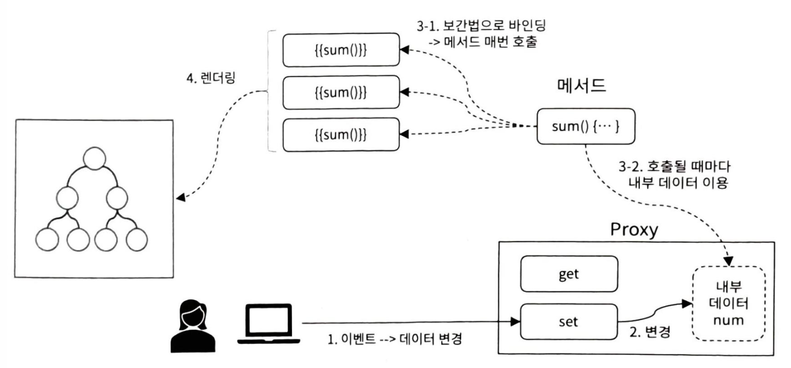

## Vue Instance

- app instance
  

## data 옵션

- 컴포넌트가 관리, 추적해야 할 데이터를 등록할 때 사용
- 객체를 리턴하는 함수로 정의 ⇒ 리턴 객체가 `Proxy`로 래핑됨
- `$`, `_` : 시작 문자로 사용 X (vue의 특수 용도)

## 계산된 속성(Computed Property)

- data/다른 속성이 변경될 때, 함수가 실행되어 저장된 캐싱된 값
- 함수의 실행 ⇒ 의존 속성/data 변경 시 한 번 호출
- 작동 방식
  

## 메서드 옵션

- vue 인스턴스에서 사용할 메서드를 등록하는 옵션
- 인스턴스에서 직접 호출/디렉티브의 표현식/`{{}}` 표현식에서 호출 가능
- 이벤트 핸들러로 이용 가능
- 작동 방식
  

## 관찰 속성(Watched Property)

- js 코드에서 데이트 변경 시 ⇒ 주로 긴 처리 시간 필요, 비동기 처리에 적합
- `watch` 옵션 객체 정의 : 함수로 정의, data 속성명과 동일한 함수명 정의
  - 매개변수
    - 첫 번째 인자 : 변경 후의 값
    - 두 번째 인자 : 변경 전의 값

## 컴포넌트 생명주기 메서드

| 생명주기 메서드       | 설명                                                                 | 실행 시점                      |
| --------------------- | -------------------------------------------------------------------- | ------------------------------ |
| `setup()`             | Composition API의 시작 지점. `data`, `computed`, `methods` 대체 가능 | 컴포넌트 생성 전에 호출됨      |
| `onBeforeMount()`     | DOM에 마운트되기 전에 호출됨                                         | 처음 마운트 전                 |
| `onMounted()`         | 컴포넌트가 DOM에 마운트된 후 호출됨                                  | 처음 마운트 직후               |
| `onBeforeUpdate()`    | 반응형 상태가 변경되어 DOM을 업데이트하기 전에 호출됨                | 업데이트 직전                  |
| `onUpdated()`         | DOM 업데이트가 완료된 후 호출됨                                      | 업데이트 완료 직후             |
| `onBeforeUnmount()`   | 컴포넌트가 DOM에서 제거되기 전에 호출됨                              | 언마운트 직전                  |
| `onUnmounted()`       | 컴포넌트가 DOM에서 완전히 제거된 후 호출됨                           | 언마운트 직후                  |
| `onErrorCaptured()`   | 하위 컴포넌트에서 오류가 발생했을 때 호출됨                          | 오류 포착 시                   |
| `onRenderTracked()`   | 반응형 상태의 종속성이 추적될 때 호출됨 (디버깅용)                   | 렌더링 중 추적 발생 시         |
| `onRenderTriggered()` | 반응형 상태가 변경되어 렌더링이 트리거될 때 호출됨 (디버깅용)        | 렌더링 트리거 발생 시          |
| `onActivated()`       | `<keep-alive>` 컴포넌트가 활성화될 때 호출됨                         | 활성화 시 (캐시에서 복원 시)   |
| `onDeactivated()`     | `<keep-alive>` 컴포넌트가 비활성화될 때 호출됨                       | 비활성화 시 (캐시에 저장될 때) |
| `beforeCreate()`      | 인스턴스가 초기화되기 전 호출. `data`, `methods` 등 접근 불가        | 가장 처음 실행됨               |
| `created()`           | 인스턴스가 생성된 후 호출. `data`, `methods` 등 접근 가능            | 데이터 설정 완료 후            |
| `beforeMount()`       | DOM에 마운트되기 전 호출됨                                           | 마운트 직전                    |
| `mounted()`           | DOM에 마운트된 후 호출됨                                             | 마운트 완료 직후               |
| `beforeUpdate()`      | 반응형 데이터 변경으로 DOM 업데이트가 일어나기 전 호출됨             | DOM 패치 전                    |
| `updated()`           | 반응형 데이터 변경 후 DOM 업데이트 완료 후 호출됨                    | DOM 패치 후                    |
| `beforeUnmount()`     | (Vue 3) 컴포넌트가 파괴되기 전에 호출됨                              | 언마운트 전                    |
| `unmounted()`         | (Vue 3) 컴포넌트가 파괴된 후 호출됨                                  | 언마운트 완료 후               |
| `activated()`         | `<keep-alive>`에서 활성화될 때 호출됨                                | 캐시 복원 시                   |
| `deactivated()`       | `<keep-alive>`에서 비활성화될 때 호출됨                              | 캐시 저장 시                   |
| `errorCaptured()`     | 하위 컴포넌트에서 오류 발생 시 호출됨                                | 오류 발생 시                   |
